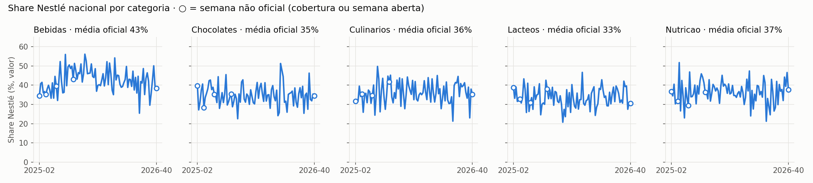
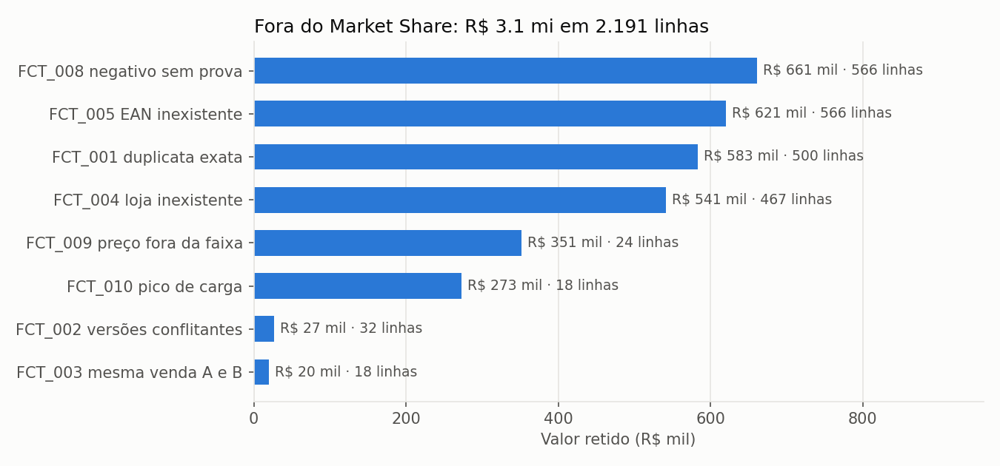

# Market Share — Data Quality

Pipeline em PySpark que consolida dados semanais de mercado de dois fornecedores e
gera uma base confiável para cálculo de Market Share.

O foco é qualidade de dados: identificar problemas nas dimensões e nas fatos, corrigir
automaticamente apenas o que é seguro, mandar para quarentena o que exige análise e
manter rastreabilidade do dado original.

## Stack

- Databricks (Free Edition, serverless)
- PySpark + Delta Lake
- Unity Catalog (schemas, tabelas e volumes)
- Databricks CLI / Asset Bundles
- PyYAML (biblioteca adicional): catálogo de regras e referências em YAML, fora do código — regra e
  parâmetro mudam por revisão de configuração, sem alterar PySpark, e ficam legíveis para o negócio

## Arquitetura (Unity Catalog)

| Objeto | Tipo | Conteúdo |
|---|---|---|
| `workspace.ms_raw.landing` | Volume | arquivos originais do case (imutáveis) |
| `workspace.ms_bronze` | Schema | dados brutos em Delta, sem tratamento, com metadados de rastreio |
| `workspace.ms_silver` | Schema | dimensões e fato tratadas |
| `workspace.ms_gold` | Schema | Market Share pronto para consumo |
| `workspace.ms_dq` | Schema | log de regras, quarentena e métricas de qualidade |

## Estrutura do repositório

| Pasta | Conteúdo |
|---|---|
| `data/raw/` | dados de entrada do case (não alterados) |
| `docs/` | matriz de requisitos e notas do projeto |
| `docs/evidencias/` | resultados exportados (pente fino, log de regras, quarentena, MS nacional) e gráficos |
| `tests/` | testes automatizados (pytest) do motor e das regras críticas |
| `scripts/` | automação do ambiente (Databricks CLI) |
| `src/dq/` | framework de Data Quality (classes reutilizáveis) |
| `src/silver/` | regras de tratamento de cada entidade da Silver (produto, loja, território, calendário, fato, cobertura) |
| `src/gold/` | Market Share e portões de publicação |
| `src/relatorios/` | pente fino, exportação das evidências e gráficos (task `evidencias`) |
| `config/` | catálogo de regras de DQ (`dq_rules.yml`) e referências das correções (`referencias.yml`) |
| `sql/profiling/` | consultas que evidenciam cada problema encontrado (antes do tratamento) |
| `sql/validacao/` | consultas que provam o tratamento: pente fino (41 verificações), trilha, reconciliação e garantias |
| `notebooks/` | notebooks do pipeline, um por task do job (formato `.py`, versionável) |
| `notebooks/dev/` | notebooks de validação do ambiente e do framework (fora do pipeline) |
| `databricks.yml` | definição do projeto como código (Databricks Asset Bundle) |

## Como executar

### 1. Pré-requisitos

- Conta no Databricks Free Edition
- Databricks CLI instalada (`databricks -v`)
- Login no workspace:

```bash
databricks auth login --host <URL_DO_WORKSPACE> --profile gf7
```

### 2. Preparar o Unity Catalog e enviar os dados

```bash
./scripts/setup_uc.sh            # perfil e catálogo opcionais: ./scripts/setup_uc.sh gf7 workspace
```

Cria os schemas `ms_raw`, `ms_bronze`, `ms_silver`, `ms_gold` e `ms_dq` no catálogo
`workspace` e envia os arquivos de `data/raw` para o volume `ms_raw.landing`.
O script é idempotente: pode ser executado várias vezes sem efeito colateral.

### 3. Publicar o projeto no workspace (Asset Bundle)

```bash
databricks bundle validate -t dev --profile gf7
databricks bundle deploy   -t dev --profile gf7
```

O deploy envia os notebooks para `/Workspace/Users/<usuario>/.bundle/market_share_dq/dev/files`
e cria os jobs definidos em `databricks.yml`. Os dados não são enviados pelo bundle
(`sync.exclude`): a única fonte é o volume `ms_raw.landing`.

### 4. Executar o pipeline

```bash
databricks bundle run -t dev pipeline_job --profile gf7
```

O job `market-share-pipeline` executa 5 tasks em sequência; se uma falha, as seguintes não rodam
(dado ruim não se propaga):

```
bronze → silver_dimensoes → silver_fato → gold → evidencias
```

| Task | Notebook | Saída |
|---|---|---|
| `bronze` | `01_bronze.py` | `ms_bronze.*` + `ms_dq.bronze_load_log` |
| `silver_dimensoes` | `02_silver_dimensoes.py` | `ms_silver.dim_produto`, `dim_loja`, `territorio_historico`, `dim_calendario` + fila `ms_dq.vw_revalidacao_loja` |
| `silver_fato` | `03_silver_fato.py` | `ms_silver.fato_vendas` + fila `ms_dq.vw_quarentena_fato` |
| `gold` | `04_gold.py` | `ms_silver.cobertura_fornecedor`, `ms_gold.*` e as views de consumo |
| `evidencias` | `05_evidencias.py` | pente fino (falha o job se houver `FALHA`) + CSVs e gráficos no Volume `ms_dq.evidencias` |

### 5. Trazer as evidências para o repositório

```bash
./scripts/baixar_evidencias.sh            # perfil e catálogo opcionais: ./scripts/baixar_evidencias.sh gf7 workspace
```

Copia o Volume `ms_dq.evidencias` para `docs/evidencias/` (pente fino, log de regras, quarentena, Market
Share nacional, amostra da fato e os gráficos), gerados pelo job a partir das tabelas publicadas.

Todos os jobs rodam em computação serverless (único tipo disponível no Free Edition).
Para desenvolvimento interativo, abra o notebook na pasta do bundle e selecione **Serverless**.

## Camadas

### Bronze (`notebooks/01_bronze.py`)

Cópia fiel dos arquivos de origem em tabelas Delta (`ms_bronze.*`), sem nenhuma correção.

- **Todas as colunas como string.** A inferência de tipos pode transformar um valor fora do
  padrão em nulo ou mudar o tipo da coluna sem aviso. Lendo como texto, nada se perde; a
  conversão acontece de forma explícita na Silver, e o que falhar vai para quarentena com o
  valor original.
- **Rastreabilidade por linha:** arquivo de origem (`_source_file`), data do arquivo
  (`_source_modified_at`), hash do conteúdo (`_row_hash`) e execução que carregou a linha
  (`_load_id`).
- **Reconciliação:** linhas carregadas × volumes declarados no README do case, e checksum
  SHA-256 de cada arquivo, registrados em `ms_dq.bronze_load_log`. Divergência interrompe o
  pipeline.
- **Idempotência:** as tabelas são sobrescritas a cada carga (reexecutar não duplica); o log é
  append-only (histórico de auditoria).

| Tabela | Linhas |
|---|---|
| `dim_produto` | 1.235 |
| `dim_loja` | 2.500 |
| `dim_calendario` | 91 |
| `customer_territory_history` | 4.736 |
| `coverage_provider` | 6.370 |
| `fact_provider_a` | 68.526 |
| `fact_provider_b` | 58.526 |

### Silver · dimensão de produto (`src/silver/produto.py`)

Resultado: **1.235 registros → 1.200 produtos, 1 por EAN** (1.098 aprovados, 71 corrigidos,
31 com alerta).

| Regra | Problema | Tratamento | Registros |
|---|---|---|---|
| PRD_004 | texto despadronizado (`delta tabletes 1l  `) | trim + maiúsculas | 95 corrigidos |
| PRD_005 | grafia da categoria (`CHOCOLATE`, `LACTEO`) | de-para para o domínio oficial | 6 corrigidos |
| PRD_006 | categoria vazia | deriva da hierarquia subcategoria → categoria | 3 corrigidos |
| PRD_002 | EAN duplicado (registro `PX####` "NOVA EMB" com categoria `OUTROS`) | mantém o id canônico `P#####`; o alias é rejeitado e listado em `alias_product_ids` | 35 rejeitados |
| PRD_007 | categoria válida, porém em conflito com a subcategoria (ex.: `CEREAIS` em `BEBIDAS`) | corrige pela hierarquia **somente** se a descrição confirma a subcategoria | 8 corrigidos |
| PRD_008 | conflito sem evidência na descrição | mantém + alerta | 0 |
| PRD_003 | EAN fora do padrão de 13 dígitos (`891…`, `EAN-000…`) | **não corrige**: a fato usa o mesmo código e corrigir só o cadastro quebraria o join. Gera `ean_sugerido` para o time de cadastro | 31 alertas |

**Por que deduplicar o EAN:** ele é a chave do join com a fato. Com dois registros para o mesmo
EAN, cada venda desses produtos seria contada duas vezes.

**Hierarquia derivada dos dados.** Não existe cadastro mestre de categorias no case, então o
de-para subcategoria → categoria é calculado a partir dos próprios produtos (categoria dominante)
e gravado com a evidência em `ms_silver.ref_hierarquia_produto`. Só é usado para corrigir quando a
concordância é de pelo menos 90% (configurável); as 5 subcategorias ficaram entre 96,7% e 98,5%.

| Subcategoria | Categoria oficial | Evidência |
|---|---|---|
| CAFE | BEBIDAS | 98,2% |
| CEREAIS | NUTRICAO | 96,7% |
| LEITE EM PO | LACTEOS | 98,5% |
| TABLETES | CHOCOLATES | 96,8% |
| TEMPEROS | CULINARIOS | 98,0% |

**Premissa:** a subcategoria é o atributo confiável (sem nulos, sem variação de grafia e presente
na descrição do produto); a categoria é derivada dela. Em produção, essa referência viria do
cadastro mestre (MDM) e o EAN seria validado pelo dígito verificador GS1.

### Silver · dimensão de loja (`src/silver/loja.py`)

Resultado: **2.500 lojas** (2.285 aprovadas, 48 corrigidas, 167 com alerta).

| Regra | Problema | Tratamento | Registros |
|---|---|---|---|
| LOJ_001 | `store_id` duplicado | quarentena | 0 |
| LOJ_002 | UF incoerente com a cidade: nome de cidade no campo UF (`São Paulo` em lojas de BH, Curitiba…), `XX` e vazio | corrige pela UF dominante da cidade | 20 corrigidos |
| LOJ_003 | CNPJ com máscara (`10.000.000/0000-28`) | remove a máscara quando restam 14 dígitos | 35 corrigidos |
| LOJ_004 | coordenada fora do território brasileiro | **não corrige**: alerta + fila de revalidação | 10 alertas |
| LOJ_005 | coordenada sem relação com a cidade (regra de dataset) | alerta: campo fora do Market Share | 2.490 |
| LOJ_006 / LOJ_007 | território / vendedor vazios | alerta (o território é resolvido na fato) | 90 / 70 |

**UF derivada dos dados.** Mesmo critério da hierarquia de produto: a UF oficial de cada cidade é
a dominante entre as lojas com UF válida, gravada com a evidência em `ms_silver.ref_cidade_uf`
(11 cidades, todas com 100% de concordância). Um de-para `São Paulo → SP` erraria as lojas de BH e
Curitiba: a cidade é o atributo confiável.

**Por que a coordenada não foi corrigida (LOJ_004).**

1. O critério usa os pontos extremos oficiais do território brasileiro (IBGE, *Brasil em Síntese*),
   versionados em `config/referencias.yml`: N 5,271944 (Monte Caburaí) · S -33,751944 (Arroio Chuí) ·
   L -34,792778 (Ponta do Seixas) · O -73,990556 (nascente do rio Moa).
2. As 10 lojas fora desses limites têm forte indício de **latitude e longitude invertidas**: trocando
   os campos, todas voltam à faixa das demais lojas.
3. Mas o campo inteiro **não corresponde à cidade** (LOJ_005): o centro médio das coordenadas varia só
   1,15° entre cidades, contra uma dispersão de 4,38° dentro de cada cidade; a correlação lat × lon é
   -0,03; apenas 0,3% das lojas estão a menos de 50 km da própria cidade. Invertidas, as 10 lojas
   ficariam de 227 a 1.407 km da cidade informada.
4. Sem referência confiável, corrigir trocaria um erro visível (ponto no oceano) por um erro invisível
   (ponto no Brasil, no lugar errado). A coordenada não entra no cálculo de Market Share, então a
   correção traria risco sem ganho.

As lojas ficam com `geo_status = REVALIDAR_INVERSAO` e entram na fila `ms_dq.vw_revalidacao_loja`
junto com as demais pendências de cadastro (UF corrigida, território e vendedor vazios), cada uma com
problema, evidência e ação sugerida. O retângulo dos pontos extremos é uma checagem necessária, não
suficiente (inclui oceano e países vizinhos); a validação real depende da melhoria abaixo.

### Silver · histórico de território (`src/silver/territorio.py`)

Histórico SCD2 por **loja × categoria** (o território depende da categoria): 4.736 vigências.

| Regra | Problema | Tratamento | Registros |
|---|---|---|---|
| TER_004 | loja do histórico inexistente na `dim_loja` | quarentena | 0 |
| TER_006 | duas vigências começando no mesmo dia | quarentena | 0 |
| TER_001 | vigências sobrepostas: CRM aberta desde 2025 × realocação MANUAL a partir de 2026-01-01 | fecha a vigência anterior em (próximo início − 1 dia) | 121 corrigidos |
| TER_002 / TER_005 | território / vendedor vazios | alerta | 169 / 130 |
| TER_003 | loja sem nenhuma vigência (regra de dataset) | alerta | 11 lojas |

**Por que fechar a vigência (TER_001).** Em 2026, cada uma das 121 combinações tinha dois territórios
vigentes: o join com a fato devolveria duas linhas e duplicaria a venda no recorte por território. A
vigência que começa depois vence: em 121 de 121 casos o território é diferente (realocação, não erro
de digitação) e em 5 deles o MANUAL preenche um CRM vazio. O histórico anterior é preservado: as
vendas de 2025 continuam no território antigo.

| store_id | category | territory_id | valid_from | valid_to (origem → Silver) | origem |
|---|---|---|---|---|---|
| S00009 | NUTRICAO | T010 | 2025-01-01 | 9999-12-31 → **2025-12-31** | CRM |
| S00009 | NUTRICAO | T022 | 2026-01-01 | 9999-12-31 | MANUAL |

**Território usado na fato (resolvido na Etapa 6):** vigência do histórico na semana (loja ×
categoria) → `dim_loja.territory_id` → `SEM_TERRITORIO`. A `dim_loja` reproduz o território do CRM
em 100% dos casos, por isso serve de fallback para as 11 lojas sem histórico e para as categorias sem
vigência própria.

**Premissa a validar com o negócio:** a atribuição MANUAL é uma realocação intencional do time comercial.

### Silver · calendário (`src/silver/calendario.py`)

Grão semanal **ISO 8601** (segunda a domingo): 91 semanas, de `2025-02` a `2026-40`.

| Regra | Problema | Tratamento | Registros |
|---|---|---|---|
| CAL_003 | `year_week` duplicado ou incoerente com o início da semana | rejeita (bloqueia o pipeline) | 0 |
| CAL_002 | semana incompleta ou com lacuna | rejeita (bloqueia o pipeline) | 0 |
| CAL_001 | ano civil da segunda-feira ≠ ano ISO | corrige para o ano da quinta-feira | 1 corrigido |
| CAL_004 | mês civil da segunda-feira ≠ mês ISO | corrige para o mês da quinta-feira | 9 corrigidos |

**Por que padronizar em ISO.** A origem misturava duas convenções: `year_week` e `week` em ISO, e
`year`/`month` pela data civil da segunda-feira. Elas divergem nas semanas que cruzam a virada do mês
— a semana `2026-01` (29/12/2025 a 04/01/2026) vinha com `year = 2025` e `month = 12`. No ISO, a
semana pertence ao ano e ao mês da **quinta-feira**, o dia do meio: é o mês que contém 4 dos 7 dias
(mês real da semana). Os valores originais ficam em `year_raw` e `month_raw`.

**Efeito:** a contagem de semanas por mês muda em alguns meses (ex.: dezembro/2025 passa de 5 para 4
semanas e janeiro/2026 de 4 para 5), e a semana aberta `2026-40` passa a pertencer a outubro/2026.
O Market Share semanal não muda; agregações mensais passam a seguir o mês real.

### Validação da Silver (`sql/validacao/01_silver_dimensoes.sql`)

| Bloco | O que prova |
|---|---|
| Log | resultado de cada regra na última execução e o histórico entre execuções |
| Trilha | antes → depois de cada correção, por regra e por registro |
| Reconciliação | registros na trilha = falhas no log, e quarentena = falhas no log (diferença 0) |
| Antes × depois | `<coluna>_raw` × valor tratado na própria tabela |
| Garantias | 1 linha por EAN e por loja, UF no domínio, CNPJ com 14 dígitos, coordenada **não alterada** (Silver = Bronze), vigências sem sobreposição, calendário em ISO e íntegro — todas com 0 violações |

### Silver · fato de vendas A + B (`src/silver/fato.py`)

**Harmonização.** Cada fornecedor tem colunas e nomes diferentes (`week` × `reference_week`,
`store_id` × `customer_code`, `ean` × `product_ean`…). O mapeamento coluna canônica ← coluna de
origem fica em `config/referencias.yml`; a união usa `unionByName(allowMissingColumns=True)`,
que casa as colunas pelo **nome** (o que só existe em um fornecedor vira NULL no outro). Coluna
obrigatória ausente interrompe o pipeline (ING_002); coluna nova não mapeada vira alerta (ING_003).

**Ordem das regras:** primeiro o que **retira** registros, depois o que **corrige**, por último o que
só **alerta** — nenhuma correção é aplicada a um registro que vai para a quarentena.

| Regra | Problema | Tratamento | Linhas | R$ |
|---|---|---|---|---|
| FCT_001 | duplicata exata (mesmo `_row_hash`) | **rejeita** as cópias, mantém 1 | 500 | 583 mil |
| FCT_002 | mesma chave, mesmo fornecedor, valores diferentes | quarentena de **todas** as versões | 32 | 27 mil |
| FCT_003 | mesma semana × loja × EAN informada por A e B | quarentena das duas | 18 | 20 mil |
| FCT_004 | loja inexistente (`UNKNOWN_*`) | quarentena | 467 | 541 mil |
| FCT_005 | EAN inexistente (`9990…`) | quarentena | 566 | 621 mil |
| FCT_007 | valor negativo **com prova** (unidades × preço médio = −valor) | corrige para o valor absoluto | 662 | 816 mil |
| FCT_008 | valor negativo **sem prova** | quarentena (devolução? estorno? erro?) | 566 | 661 mil |
| FCT_009 | preço unitário ~10× acima da faixa da série (S00019/S00020, 2026-12 a 15) | quarentena | 24 | 351 mil |
| FCT_010 | pico ≥ 20× a mediana da série por ≤ 2 semanas | quarentena (provável erro de carga) | 18 | 273 mil |
| FCT_011 | desvio sustentado (13–21× por 8–9 semanas, S00001–S00012) | alerta (promoção/evento real) | 255 | 1,2 mi |
| FCT_014 / 015 | unidades zeradas com valor / volume zerado com unidades | alerta | 681 / 900 | |
| FCT_016 | venda zero explícita | aprovado (prova cobertura da loja) | 85 | 0 |
| FCT_017 | semana 2026-40 gerada antes de fechar (arquivo de 01/10, semana até 04/10) | alerta → MS não oficial | 1.308 | 1,5 mi |
| FCT_018 | sem território (histórico → `dim_loja` → `SEM_TERRITORIO`) | alerta | 4.168 | 5 mi |
| FCT_020 | volume não acompanha unidades × embalagem (regra de dataset) | alerta; premissa kg | 99.397 | |

**Conservação de registros:** 127.052 linhas na Bronze = **124.861** na Silver + **2.191** em
quarentena ou rejeitadas. Nada some em silêncio — o notebook falha se a conta não fechar.

**Decisões e por quê**

- **Negativos.** Só o fornecedor A tem `average_price`: em 662 casos, unidades × preço médio reproduz
  exatamente o valor com o sinal trocado — prova suficiente para corrigir. No B não há como provar;
  pode ser devolução. Corrigir sem prova mudaria o Market Share.
- **Picos × eventos.** Sem limite global fixo: cada série fornecedor × loja × produto tem a própria
  baseline (mediana + MAD — robustas a até 50% de pontos ruins, ao contrário de média e desvio).
  Magnitude **e** duração decidem: um erro de carga não dura 9 semanas seguidas em 3 produtos da mesma
  loja; uma promoção dura. Duração calculada com *gaps-and-islands* (Window).
- **Faixa de preço.** Fator 3× sobre a mediana da série (com ≥ 26 semanas) ou 20× sobre a do produto:
  o preço legítimo de um mesmo produto varia ~18× entre lojas (R$ 3 a R$ 55); um fator menor jogaria
  vendas corretas na quarentena.
- **Território na virada do ano.** A data de referência da semana é a **quinta-feira** (mesma regra ISO
  do calendário): a semana 2026-01 tem 4 dias em 2026 e já usa a vigência nova.
- **Joins com broadcast** no lado menor (calendário, loja, produto, histórico de território). Exceção
  consciente: os agregados por série (~119 mil séries para ~125 mil linhas) **não** levam broadcast —
  têm quase o tamanho da fato e crescem com ela; o AQE decide.
- **Serverless sem `cache()`:** os intermediários são gravados em Delta (`stg_*`) e relidos, cortando a
  linhagem; as tabelas temporárias são apagadas no fim.

**Fila de tratativa da quarentena (`ms_dq.vw_quarentena_fato`).** Uma linha por regra × fornecedor ×
semana com linhas e R$ retidos, exemplo de motivo, arquivo de origem, **ação sugerida e responsável**
(fornecedor, cadastro ou negócio — configurado em `referencias.yml`). Quando o fornecedor reenvia o
arquivo corrigido, a reexecução tira o registro da quarentena sozinha (`replaceWhere` por alvo).

### Silver · cobertura dos fornecedores (`src/silver/cobertura.py`)

Cobertura declarada por fornecedor × semana × rede (lojas esperadas × lojas recebidas). É a base para
separar **ausência de venda** de **ausência de cobertura**.

| Regra | Problema | Tratamento | Linhas |
|---|---|---|---|
| COV_002 | lojas recebidas > esperadas | cobertura limitada a 100% + alerta | 999 |
| COV_003 | arquivo recebido com 0 lojas | cobertura 0 + alerta | 180 |
| COV_004 | metadado diz "não recebido", mas há dados na fato | cobertura 0 (conservador) + alerta | 73 |
| COV_005 | entrega atrasada | alerta (pontualidade) | 3.085 |
| COV_006 | entrega esperada 3 dias **antes** do fim da semana | alerta; semântica a validar com o fornecedor | 6.370 |
| COV_008 | mais lojas na fato do que o declarado | alerta (a fato traz só linhas com movimento) | 519 |

**Cobertura efetiva (conservadora):** arquivo não recebido = 0; recebidas limitadas ao esperado.

### Gold · Market Share (`src/gold/market_share.py`, `notebooks/04_gold.py`)

**Fórmula**, por célula = semana × categoria × recorte:

```
MS_valor(marca)  = Σ sales_value_brl(marca) / Σ sales_value_brl(todas as marcas da categoria)
MS_volume(marca) = Σ sold_volume_kg(marca)  / Σ sold_volume_kg(todas as marcas da categoria)
```

- **Granularidade:** semana ISO × categoria × marca, em 5 recortes — nacional, rede, canal, UF e
  território (258.873 linhas).
- **Mesma base no numerador e no denominador:** só entram registros aprovados, corrigidos ou com alerta.
  Quarentena e rejeitados ficam fora dos dois lados.
- **Valor é a métrica principal.** Volume é secundário: o volume informado não reconcilia com a
  embalagem do cadastro (FCT_020) e a unidade (kg) é premissa.
- Razão entre `DECIMAL`s arredondada a 8 casas: resultado idêntico entre execuções.

**Portões de publicação.** O Market Share é calculado numa tabela de *staging*, validado e só então
publicado; se um portão crítico falha, o job para e a versão anterior da Gold continua no ar.

| Portão | Critério | Resultado |
|---|---|---|
| GLD_001 | conservação Bronze = Silver + quarentena | 127.052 = 124.861 + 2.191 |
| GLD_002 | joins não duplicam valor | Σ Silver = Σ Gold = Σ MS nacional = R$ 140.005.700,98 |
| GLD_003 | shares somam 100% em cada célula | 55.441 células, 0 falhas |
| GLD_005 | nenhuma coluna pessoal/sensível na Gold | 0 colunas |
| GLD_004 | célula **oficial**: semana fechada, cobertura ≥ 80%, quarentena ≤ 5% | 200.365 oficiais (77%) |

Uma célula que não passa no GLD_004 **continua calculada**, mas `ms_value_official` fica nulo e
`ms_status` diz o motivo: `NAO_OFICIAL_COBERTURA` (45.727), `NAO_OFICIAL_QUARENTENA` (9.895) ou
`NAO_OFICIAL_SEMANA_ABERTA` (2.884). O consumidor nunca recebe um número incompleto sem aviso.

**Tabelas materializadas + views de consumo.**

| Objeto | Para quê |
|---|---|
| `ms_gold.fato_vendas` | fato consumível (124.861 linhas) com dimensões e flags de qualidade |
| `ms_gold.cobertura_semana_rede` | cobertura A + B por semana × rede |
| `ms_gold.market_share` | todas as células, com status de publicação |
| `vw_market_share_oficial` | **só o oficial**, com nomes de negócio — contrato estável para o BI |
| `vw_share_nestle` | share dos produtos próprios por semana × categoria × recorte |
| `vw_cobertura_fornecedor` | esperado × declarado × considerado × observado, com os alertas |

Tabela materializada (e não só view) para validar **antes** de publicar, ter histórico (*time travel*)
do que foi publicado e custo previsível; views para contrato estável e acesso mínimo (o consumidor
recebe permissão na view, não na tabela).

## Monitoramento

| Onde | O que mostra |
|---|---|
| `ms_dq.rule_results` | uma linha por regra × alvo × execução (append): avaliados, falhas, % e R$ impactado, resultado — base de tendência |
| `ms_dq.quarantine` | cada registro retirado: regra, severidade, motivo, arquivo de origem e payload original |
| `ms_dq.corrections` | cada correção: antes → depois, por regra e chave |
| `ms_dq.bronze_load_log` | linhas e SHA-256 de cada arquivo por carga |
| `vw_quarentena_fato`, `vw_revalidacao_loja` | filas de trabalho, com ação e responsável |
| `ms_gold.market_share.ms_status` | por que cada célula não é oficial |
| `sql/validacao/*.sql` | reconciliação log × trilha × quarentena e garantias (todas devem dar 0) |

**Alerta por e-mail:** o job notifica o dono do deploy em qualquer falha (`email_notifications` no
`databricks.yml`, com o usuário da CLI — nenhum e-mail no repositório).

**Pente fino:** `sql/validacao/00_pente_fino.sql` — uma consulta com 41 verificações (Bronze, Silver, DQ
e Gold), esperado × obtido; critério de entrega: todas `OK`.

**Alertas que o job dispara sozinho:** reconciliação da Bronze, unicidade das dimensões, UF fora do
domínio, vigência sobreposta, calendário quebrado, conservação da fato, chave duplicada, valor negativo
e os portões GLD — qualquer um falha a task e interrompe as seguintes.

## Testes e validação

Três camadas, do código ao dado publicado:

| Camada | O quê | Onde |
|---|---|---|
| **Testes unitários** | 13 testes com DataFrames pequenos e casos de borda: motor (check/correct/quarantine, NULL não vira falha, precedência de status, flush só limpa os próprios alvos), UF pela cidade, CNPJ, coordenada **não** alterada, vigência SCD2, calendário ISO, negativo só corrige com prova, pico × evento, `unionByName` A + B | `tests/` — `pip install -r requirements-dev.txt && pytest -q tests/` |
| **Garantias no job** | asserts em cada notebook e portões GLD: falham a task e bloqueiam as seguintes | `notebooks/*`, `src/gold/market_share.py` |
| **Pente fino** | 41 verificações ponta a ponta (Bronze → Gold), esperado × obtido — roda como última task do job e o falha se houver `FALHA` | `sql/validacao/00_pente_fino.sql` · resultado em `docs/evidencias/pente_fino.csv` (41/41 OK) |

Os testes acharam e corrigiram dois casos de borda antes de chegarem a produção: coordenadas constantes
derrubariam a LOJ_005 (divisão por zero no modo ANSI) e uma série perfeitamente constante (MAD = 0)
esconderia um pico de 30×. As correções não mudaram nenhum resultado nos dados do case.

## Respostas às perguntas do case

**1. Principais problemas e priorização.** Priorizei pelo efeito no Market Share:
(1) o que **duplica valor** — duplicatas exatas (500 linhas, R$ 583 mil), EAN duplicado no cadastro
(35) e vigências sobrepostas de território (121), que multiplicariam a venda no join;
(2) o que **distorce valor** — preço ~10× (R$ 351 mil), picos de carga (R$ 273 mil), negativos
(1.228 linhas); (3) o que **impede alocar** — lojas e EANs inexistentes (1.033 linhas, R$ 1,2 mi),
categoria errada no cadastro; (4) **cobertura e temporalidade** — 28% das células fornecedor × semana ×
rede abaixo de 80% de cobertura e a semana 2026-40 ainda aberta; (5) cadastro sem efeito no MS —
CNPJ, coordenadas, vendedor.

**2. O que é seguro automatizar × análise manual.** Automatizo só correção **determinística e com
prova**: duplicata exata, padronização de texto e grafia, UF pela cidade e categoria pela hierarquia
(evidência ≥ 90%), sinal invertido quando unidades × preço reproduz o valor, vigência sobreposta,
calendário ISO. Vai para análise o que tem mais de uma explicação possível: versões conflitantes,
A × B, negativo sem prova, preço e picos fora da faixa, órfãos. Fica como alerta, sem alterar, o que
não tem referência confiável (coordenada, EAN malformado que a fato também usa).

**3. Dado original e rastreabilidade.** A entrada é imutável (volume + SHA-256 no log). Na Bronze, cada
linha tem arquivo, data do arquivo, hash e execução. Cada correção guarda `<coluna>_raw` na própria linha
e antes → depois em `ms_dq.corrections`; cada registro retirado vai para `ms_dq.quarantine` com o payload
original inteiro. `dq_flags` e `dq_status` em cada linha dizem quais regras ela violou.

**4. Ausência de venda × ausência de cobertura.** São coisas diferentes e tratadas diferente:
venda zero explícita (FCT_016) é dado real e prova que a loja foi coberta; falta de linha numa rede com
cobertura declarada baixa é **dado faltante**. A cobertura efetiva vem do metadado do fornecedor
(`coverage_provider`), de forma conservadora; célula com cobertura < 80% não é publicada como oficial.

**5. Dados incompletos não distorcerem o MS.** Mesma base no numerador e no denominador (o que sai, sai
dos dois lados); portões por célula (cobertura, quarentena, semana aberta); share não oficial publicado
com o motivo e `ms_value_official` nulo; `value_alert_pct` informa quanto do valor da célula está sob
alerta (eventos atípicos).

**6. Integridade, idempotência e reprocessamento.** Tabelas sobrescritas por completo a cada execução;
log de regras em append; quarentena e correções substituídas por alvo (`replaceWhere`), então reexecutar
uma etapa não duplica nem apaga a de outra. Nenhuma regra depende de relógio, ordem física ou
aleatoriedade; valores em `DECIMAL`. Garantias automáticas: conservação, chave única, Σ valor Silver =
Gold = MS, shares = 100%. Para reprocessar uma semana corrigida, basta recarregar o arquivo e rodar o job.

**7. Mudança de schema e produção.** O mapeamento de colunas por fornecedor está em configuração:
coluna obrigatória ausente interrompe (ING_002), coluna nova vira alerta (ING_003) e nunca é descartada
da Bronze (tudo como string). Para produção: o projeto já é um Databricks Asset Bundle (código, jobs e
parâmetros versionados), então basta adicionar targets `hml`/`prd`, deploy por CI/CD (GitHub Actions +
`bundle deploy -t prd`), agenda semanal após o prazo de entrega do fornecedor, alertas do job e
permissões por schema (consumidor só nas views).

**8. Limitações e riscos.** Ver a seção abaixo.

## Insights

Gráficos em `docs/evidencias/graficos/`; números a partir das tabelas tratadas.



1. **Nestlé tem ~37% do valor nacional** (R$ 51,3 mi de R$ 140 mi). Por categoria, o share oficial médio
   vai de 33% (lácteos) a 43% (bebidas), com amplitude grande entre semanas (ex.: bebidas de 25% a 56%).
2. **A qualidade impediria uma leitura errada de R$ 3,1 mi** (2,2% do valor): duplicatas, preço 10×,
   picos de carga, negativos sem prova e órfãos ficaram fora do cálculo. Só as duplicatas inflariam o MS
   em R$ 583 mil.

   

3. **Cobertura é o maior limitador do MS oficial:** 28% das células fornecedor × semana × rede estão
   abaixo de 80%; no recorte por rede, 25% das células não são oficiais, contra 5% no nacional.
4. **Eventos sustentados concentram-se em 12 lojas** (S00001–S00012, até 21× a mediana por 9 semanas):
   R$ 1,2 mi publicados com alerta — confirmar com o negócio se são promoções.
5. **Os dois fornecedores atrasam metade das entregas** (A 49%, B 48%), e a semana mais recente sempre
   chega antes de fechar: o MS da última semana nunca deve ser lido como oficial no dia da carga.

## Limitações e riscos

- **Dados sintéticos:** coordenadas sem relação com a cidade (LOJ_005); volume que não acompanha a
  embalagem (FCT_020). Por isso coordenada fica fora do MS e o MS em volume é secundário.
- **Premissas a validar com o negócio/fornecedor:** unidade do volume (kg); MANUAL substitui CRM no
  território; semântica do prazo de entrega (COV_006); qual fornecedor vence quando A e B informam a
  mesma venda (hoje: quarentena das duas).
- **Referências derivadas dos dados** (hierarquia de produto, UF por cidade): funcionam com evidência
  ≥ 90%, mas o certo em produção é cadastro mestre (MDM).
- **Cobertura declarada pelo fornecedor:** se o metadado estiver errado, o portão erra junto (COV_004 e
  COV_008 mostram que ele não é 100% confiável).
- **Calendário em ISO:** agregações mensais seguem o mês da quinta-feira; dezembro/2025 tem 4 semanas.
- **Quarentena sem fluxo de liberação** (decisão manual registrada e aplicada pelo pipeline) — ver
  próximas melhorias.
- **LGPD:** o arquivo de contatos não é ingerido; um uso futuro (ex.: enviar relatório à loja) seria outro
  processo, com base legal própria, acesso restrito e fora da camada analítica.

## Framework de Data Quality (`src/dq/`)

Toda regra é declarada em `config/dq_rules.yml` com os campos exigidos pelo case:
**id, descrição, dimensão, escopo, severidade, critério, tratamento** e a classificação aplicada
quando ela falha. Resultado, volume avaliado, falhas e valor impactado são calculados a cada
execução e gravados no log. O código só pode usar regras que estão no catálogo.

| Operação | Efeito | Rastro |
|---|---|---|
| `check` | marca a falha no registro (`dq_flags`); o dado não muda | log |
| `correct` | aplica correção determinística; o original fica em `<coluna>_raw` | log + `ms_dq.corrections` (antes → depois) |
| `quarantine` | retira o registro do fluxo | log + `ms_dq.quarantine` (regra, severidade, motivo, arquivo de origem, payload original) |
| `record` | regra de nível de dataset (ex.: reconciliação) | log |

Cada registro recebe `dq_status`, a classificação de maior precedência entre as regras que violou:

`APROVADO` < `CORRIGIDO_AUTOMATICAMENTE` < `APROVADO_COM_ALERTA` < `QUARENTENA` < `REJEITADO`

`REJEITADO` é usado para o que é descartado com justificativa (ex.: cópia de duplicata exata);
`QUARENTENA` é o que aguarda análise.

| Tabela | Escrita | Por quê |
|---|---|---|
| `ms_dq.rule_results` | append | histórico de execuções, base para tendência no monitoramento |
| `ms_dq.quarantine` | substitui por alvo (`replaceWhere`) | reexecutar uma etapa não duplica a quarentena dela nem apaga a de outra etapa |
| `ms_dq.corrections` | substitui por alvo (`replaceWhere`) | idem |

O motor é compatível com computação serverless: não usa `cache()`, `sparkContext` nem RDD, e
calcula avaliados, falhas e valor impactado em uma única passada por regra.

## Próximas melhorias

- **Geolocalização de lojas.** Incluir endereço e CEP na `dim_loja` a partir do cadastro/CRM,
  geocodificar o CEP por base oficial e criar a regra "distância entre a coordenada informada e a do
  CEP > 50 km → alerta". A validação de fronteira passaria do retângulo dos pontos extremos para o
  polígono oficial do IBGE. Endereço de loja (pessoa jurídica) não é dado pessoal, mas deve ficar
  separado dos contatos sensíveis.
- **Cadastro mestre.** Hierarquia de produto e UF por cidade vindas de MDM, em vez de derivadas dos dados.
- **Liberação da quarentena.** Tabela `ms_dq.quarantine_decisoes` (chave, LIBERAR/DESCARTAR, responsável,
  data, justificativa) aplicada na execução seguinte, com a flag de quem liberou.
- **Precedência entre fornecedores** configurável para a FCT_003, depois de acordada com o negócio.
- **Ambientes e agenda:** targets `hml`/`prd` no bundle, CI/CD (GitHub Actions: `bundle validate` no PR,
  `bundle deploy -t prd` no merge) e agendamento semanal depois do prazo de entrega do fornecedor.
- **Processamento incremental.** Hoje cada execução reprocessa tudo (127 mil linhas, ~5 min) — simples e
  idempotente. Com volume de produção: carregar só os arquivos novos (Auto Loader), reprocessar apenas as
  semanas afetadas e gravar com `replaceWhere` por `year_week` (ou `MERGE` pela chave), recalculando as
  séries com a janela de histórico necessária para a baseline.
- **Testes no CI:** rodar o `pytest` a cada PR (GitHub Actions) antes do `bundle deploy`.

## Dados sensíveis

O arquivo `sensitive_store_contacts.csv` contém dados pessoais de contato (nome, e-mail, telefone) e
não é necessário para o cálculo de Market Share. Pela minimização da LGPD (art. 6º, III), ele:

1. não é versionado no Git (`.gitignore`);
2. não é enviado ao Databricks (`scripts/setup_uc.sh` pula `sensitive_*`);
3. não é lido por nenhum notebook;
4. é bloqueado na publicação: o portão **GLD_005** falha a Gold se aparecer coluna de contato, CNPJ ou
   coordenada (`colunas_proibidas` em `config/referencias.yml`).

## Status

Concluído. Pipeline completo (Bronze → Silver → Gold) rodando no workspace de desenvolvimento,
validado pelo pente fino (41/41 OK) e por 13 testes automatizados.
Acompanhamento dos requisitos em
[docs/00_rastreabilidade.md](docs/00_rastreabilidade.md).